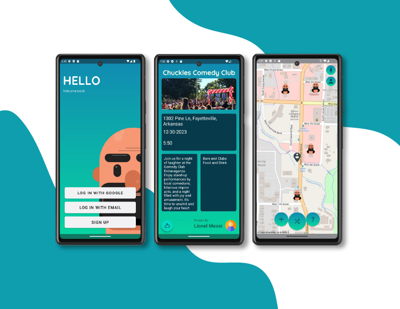

# CSCE4623-Fayettefun

## Overview
Fayettefun is an application that uses location services to allow users to express their creativity and passion by creating events that fit them and describe them. An application that is meant to allow users to interact more with their community and meet interesting people in the process. 
## System Information
* Developed on Android Studio Giraffe
* Minimum SDK: API 33 (“Tiramisu”; Android 13.0)
* Language: Kotlin
## Technology used
* User authentication leverages Firebase Authentication.
* Cloud-based database powered by Firebase Firestore.
* Mapping functionality integrated with Osmdroid API (OpenStreetMap for Android).
## Key features
* Sign in/Register: Seamlessly log in or register using your Google account, email address, or phone number.
* Create Events: Unleash your creativity by crafting and sharing events through the intuitive “+” button.
* Discover Random Events: Embrace spontaneity by discovering random events in your area with the “random” button.
* Express Interest: Show appreciation for events that catch your eye by liking them.
* Edit Your Profile: Enjoy flexibility by easily editing the details of your profile.
